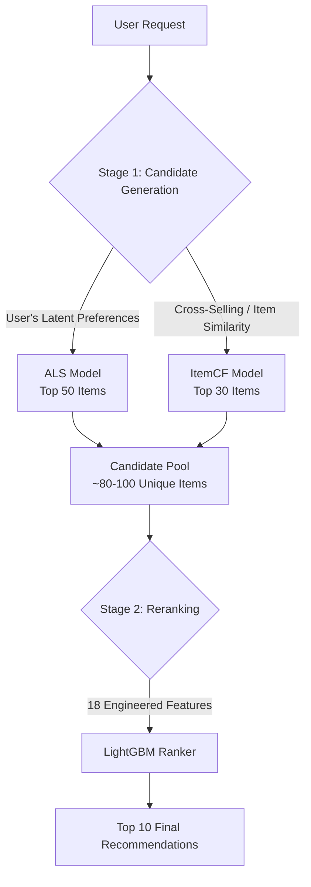

# Enterprise-Scale E-commerce Recommendation System


## Project Overview
This repository contains the implementation of a scalable, **Two-Stage Recommendation System** designed for a large-scale e-commerce dataset. Built to address real-world business challenges, the system optimizes product discovery and cross-selling capabilities by serving highly personalized recommendations.

The project demonstrates an end-to-end Machine Learning Engineering pipeline, from handling massive datasets (Out-of-Core/Memory-optimized processing) to advanced feature engineering and multi-stage ranking architectures.

## Team Members Information
* Trương Hoàng Thành An - 23520032
* Lê Ngọc Thành - 23521443 
* Nguyễn Xuân An - 23520023 

## Dataset Specifications
The system was trained and evaluated on a massive real-world transaction dataset:
- **Transactions:** ~39,000,000 records
- **Unique Users:** ~2,500,000
- **Unique Items:** ~21,000

*Note: Due to the extreme size of the dataset, memory optimization techniques (such as data type downcasting `int64` -> `int8/int16`, chunking, and sparse matrices) were heavily utilized during the Exploratory Data Analysis (EDA) and Training phases to prevent Out-Of-Memory (OOM) errors.*

## System Architecture (Two-Stage Pipeline)
To balance computational efficiency and recommendation accuracy at scale, this system adopts the industry-standard **Candidate Generation & Reranking** architecture.



### 1. Stage 1: Candidate Generation (Recall)
The goal of this stage is to quickly filter down 21,000 items to a manageable pool of ~100 highly relevant candidates for each user.
- **ALS (Alternating Least Squares):** A Matrix Factorization technique used to capture the "latent DNA" (128 dimensions) of users and items based on the entire transaction history. Excellent at discovering *personalized taste*.
- **ItemCF (Item-based Collaborative Filtering):** Computes item-to-item similarity matrices. Excellent for *cross-selling* (e.g., "Customers who bought this also bought...").

### 2. Stage 2: Reranking (Precision)
The ~100 candidates from Stage 1 are passed to a powerful gradient boosting tree model to determine the exact order of the Top 10 items.
- **Model:** LightGBM (highly optimized for tabular data and ranking objectives).
- **Goal:** Maximize Precision@10 by evaluating complex, non-linear interactions between the user, the item, and temporal context.

## Smart Feature Engineering
The LightGBM reranker utilizes **18 carefully engineered features** to make its final decision. These features are extracted to answer specific behavioral questions:

1. **AI Model Scores (3):** Includes `als_score`, `cf_score`, and a weighted `combined_score`.
2. **User Behavior (4):** `user_purchase_count`, `is_repeat_buyer`, `is_frequent_buyer` (Identifies VIPs and brand loyalty).
3. **Item Popularity (2):** `popularity`, `log_popularity` (Captures market trends and social proof while mitigating outlier effects).
4. **Recency (4):** `recency_score`, `days_since_last`, `days_since_first` (Models the user's purchase cycle - e.g., milk needs to be repurchased every 30 days).
5. **Frequency (2):** `user_item_frequency` (Measures user affinity to specific items).
6. **Item Statistics (1):** `repurchase_rate` (A proxy for item quality and customer satisfaction).
7. **Binary Flags (2):** Source indicators (`has_als_score`, `has_cf_score`).

## Performance & Evaluation
The primary metric for this system is **Precision@10**. A critical aspect of our evaluation methodology is distinguishing between **"With History"** and **"Without History"** recommendations. 

To prevent artificially inflated scores, the evaluation pipeline includes a strict `filter_bought_items` logic:
```python
def precision_at_k(pred, gt, hist, filter_bought_items=True, K=10):
    # ...
    for user in gt.keys():
        relevant_items = set(gt[user])
        if filter_bought_items:
            # Strictly exclude items the user has already purchased in the past
            relevant_items -= set(hist[user]) 
            
        hits = len(set(pred[user][:K]) & relevant_items)
        precisions.append(hits / K)
    # ...
```
By explicitly filtering out items the user has already bought (`without history` evaluation), we ensure the model is evaluated on its true ability to discover *new* products (Cross-selling/Upselling) rather than lazily recommending past purchases.

| Model / Pipeline | Precision@10 | Description |
| :--- | :---: | :--- |
| **ALS Only** | ~6.50% | Good baseline for personal taste discovery. |
| **ItemCF Only** | ~3.20% | Weak on its own, but powerful for cross-selling when ensembled. |
| **ALS + ItemCF** | ~7.80% | Ensembling improves candidate quality significantly. |
| **ALS + ItemCF + LightGBM** | **8.82%** | **State-of-the-Art for this dataset.** |

**Business Impact:** With a strict Precision@10 of 8.82% (predicting *new* items the user hasn't bought before), for every 10 items recommended, the user will organically discover and purchase ~0.88 new items on average. Deployed to a user base of 2.5M, this represents a massive uplift in Conversion Rate (CVR) and overall Gross Merchandise Value (GMV) while minimizing the Cold-Start problem.

